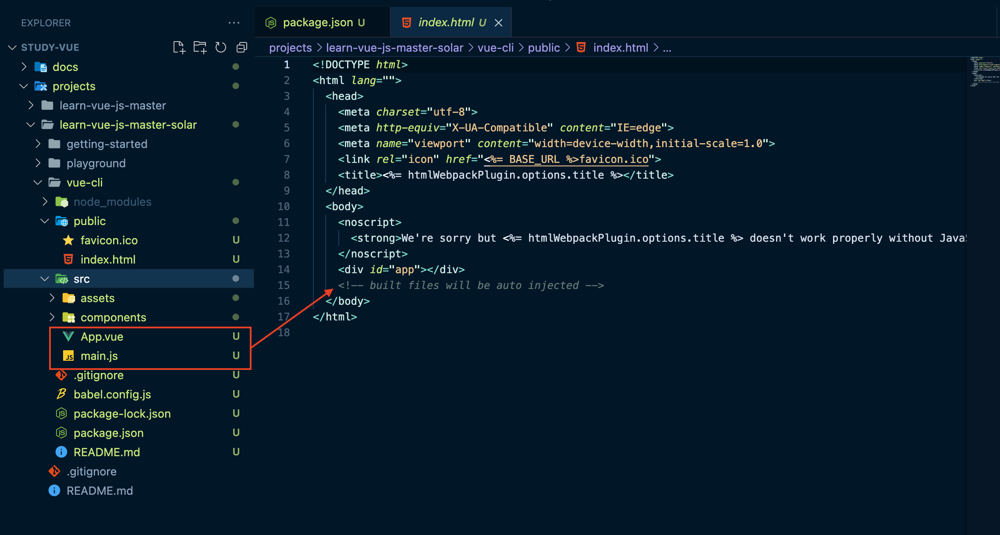
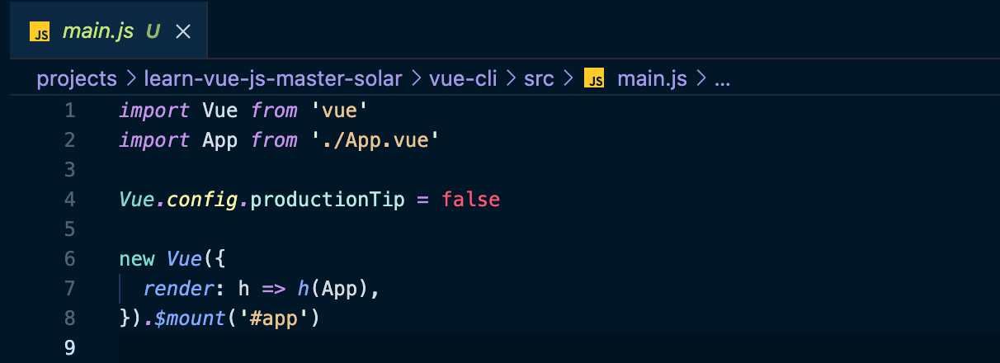

# Vue CLI

> [Vue CLI 공식 사이트 링크](https://cli.vuejs.org/)
> ※ 설치 오류 시 참고 - [Where does npm install packages? 스택 오버 플로우 글](https://stackoverflow.com/questions/5926672/where-does-npm-install-packages)


```shell
#node 버전 확인 -> 10 이상으로
node -v
#npm 버전 확인 -> 6 이상으로
npm -v
#Vue CLI 설치
npm install -g @vue/cli
#Vue 버전 확인
vue --version
```


## 프로젝트 생성

서비스를 구현할 수 있는 기본 구성이 갖춰진다.

```sh
# [Vue CLI 2.x]
vue init '프로젝트 템플릿 유형' '프로젝트 폴더 위치'
vue init webpack-simple '프로젝트 폴더 위치'

# [Vue CLI 3.x]
vue create '프로젝트 폴더 위치'
vue cretae vue-cli #4.5 이상이어서 Default ([Vue 2]) 선택
```

* 뷰 CLI 버전 4.5.x 이상은 아래 옵션으로 프로젝트를 생성


> [웹 개발할 때 알아두면 좋은 리눅스 명령어 글](https://joshua1988.github.io/web-development/linux-commands-for-beginners/)


### 서버 실행

```sh
cd vue-cli
npm run serve
```


### 프로젝트 구조


* `npm run serve` : npm(노드 패키지 매니저)은 `package.json` 에 정의한 `scripts : serve` 명령을 실행한다.

  ```sh
  vue-cli-service serve
  # 위 vue-cli-service serve 명령이 serve로 정의되어있어서 다음과 같이 간단하게 실행할 수 있다.
  npm run serve
  ```

  

* `package.json` 

  


### `npm run serve` 명령으로 실행되는 파일은 무엇인가?

`public > index.html` 파일을 보면 `app` id를 가진 div 태그가 있다.

`built files`(빌드된 파일들)이 자동으로 추가된다.

`built file`은 `src` 하위에 있는 `App.vue`, `main.js` 등등의 여러 파일을 종합해서 하나(최소)의 파일로 변환해서 넣어준다.

(내부적으로 webpack으로 돌아가기 때문에 webpack을 학습해볼 것을 추천)




* `main.js` 내용

  


위 구조는 앞서 학습한 구조와 이렇게 동일하다.

```js
new Vue({
  //render: h => h(App),
}).$mount('#app')

new Vue({
  el: '#app'
})
```


* render

  Vue 내부적으로 사용하는 함수. 사용자도 사용하는 함수

  템플릿 속성을 정희하면 내부적으로 render함수가 실행된다.


다시 한번 전체 코드를 보자

```js
import Vue from 'vue'
import App from './App.vue' //컴포넌트 파일 임포트

Vue.config.productionTip = false

new Vue({
  render: h => h(App), //App 컴포넌트를 랜더
}).$mount('#app')

```

* `.vue` : single file 컴포넌트
* `import App from './App.vue'` : 컴포넌트 파일을 불러와서 사용한다.

즉, 다음과 같이 생각하면 된다.

```js
//import App from './App.vue' //외부 컴포넌트 파일을 불러와서 사용

//App 컴포넌트 정의
var App = {
  template: '<div>app</div>'
}

new Vue({
  // render: h => h(App), //App 컴포넌트를 랜더
  components: { //App 컴포넌트를 랜더
    'app': App
  }
}).$mount('#app')
```


# 싱글 파일 컴포넌트 소개 및 여태까지 배운 내용 적용하는 방법

> Vetur 플러그인이 0.22 버전으로 업데이트되면서 싱글 파일 컴포넌트 코드 단축키가 **`scf`**에서 **`vue`**로 바뀌었습니다 :)

1. 싱글 파일 컴포넌트 생성

   `src` 우클릭 > 새파일 > `a.vue`

2. `vue` 입력 후, `tab`을 누르면 자동으로 코드 생성

   ```vue
   <template>
     <!-- HTML -->
   </template>
   
   <script>
   export default {
       // Javascript
   }
   </script>
   
   <style>
       /* CSS */
   </style>
   ```

화면의 영역을 나눴을 때, 특정 영역에 해당하는 HTML, Javascript, CSS를 한 파일에 관리하는 것이 **싱글 파일 컴포넌트**이자 **`.vue`**파일 이다.

원래 html 파일에 정의했던 코드는 다음과 같이 적어주면 된다.

```html
var appHeader = {
    template: '<div>header</div>',
    methods: {
        addNum = function() {

        }
    }
}
```

```vue
<template>
  <!-- HTML -->
  <div>header</div>
</template>

<script>
export default {
    // Javascript - 인스턴스 옵션
    methods: {
        addNum = function() {
            
        }
    }
}
</script>
```


# App.vue와 HelloWorld.vue 설명

* `main.js`

  ```js
  import Vue from 'vue'
  import App from './App.vue' //App.vue 파일내용을 App 변수에 저장
  
  Vue.config.productionTip = false
  
  new Vue({
    render: h => h(App),
  }).$mount('#app')
  ```


## App.vue

```vue
<template>
  <div id="app">
    
    <HelloWorld msg="Welcome to Your Vue.js App"/>
  </div>
</template>

<script>
import HelloWorld from './components/HelloWorld.vue'

export default {
  // 인스턴스 옵션 속성 or 컴포넌트 옵션 속성
  name: 'App',
  components: {
    HelloWorld
  }
}
</script>

<style>
#app {
  font-family: Avenir, Helvetica, Arial, sans-serif;
  -webkit-font-smoothing: antialiased;
  -moz-osx-font-smoothing: grayscale;
  text-align: center;
  color: #2c3e50;
  margin-top: 60px;
}
</style>
```


### template

다음은 컴포넌트 태그를 등록하는 것과 같다.

```vue
<HelloWorld msg="Welcome to Your Vue.js App"/>
<!-- <hello-world></hello-world> --> 
```

* 컴포넌트 태그 명명법 3가지

  * VSCode가 제공하는 파일 바로가기 기능을 사용하려면 첫번째 방식으로 작성해야 한다. (※ Vue.js 스타일 가이드 참고)

  ```html
  <hello-world></hello-world>
  <HelloWorld></HelloWorld>
  <HelloWorld/>
  ```


### script

컴포넌트 정의부분은 다음을 축약한 것과 같다.

* `'hello-world': HelloWorld` 

  HelloWorld 컴포넌트 내용을 hello-world라는 이름으로 컴포넌트 이름에 저장한 것이고, 이 것이 HTML 파일에서 `<hello-world></hello-world>` 영역에 표시되는 것이다.

```vue
<script>
import HelloWorld from './components/HelloWorld.vue'

export default {
  // 인스턴스 옵션 속성 or 컴포넌트 옵션 속성
  name: 'App',
  components: {
    HelloWorld //'hello-world': HelloWorld
  }
}
</script>
```

즉, 다른 `.vue` 싱글 파일 컴포넌트에서 컴포넌트 내용을 들고 와서 (import), `components`에서 컴포넌트를 연결해서 사용한다.

`export default{}`를 `new Vue({})`라고 보면 된다.

```js
new Vue({
  name: 'App',
  components: {
    HelloWorld //'hello-world': HelloWorld
  }
})
```

`export default` 에 **인스턴스 옵션 속성** 또는 **컴포넌트 옵션 속성**을 작성하면 된다.


## HelloWorld.vue

```vue
<template>
  <div class="hello">
    <h1>{{ msg }}</h1>
    <p>
      For a guide and recipes on how to configure / customize this project,<br>
      check out the
      <a href="https://cli.vuejs.org" target="_blank" rel="noopener">vue-cli documentation</a>.
    </p>
    <h3>Installed CLI Plugins</h3>
    <ul>
      <li><a href="https://github.com/vuejs/vue-cli/tree/dev/packages/%40vue/cli-plugin-babel" target="_blank" rel="noopener">babel</a></li>
      <li><a href="https://github.com/vuejs/vue-cli/tree/dev/packages/%40vue/cli-plugin-eslint" target="_blank" rel="noopener">eslint</a></li>
    </ul>
    <h3>Essential Links</h3>
    <ul>
      <li><a href="https://vuejs.org" target="_blank" rel="noopener">Core Docs</a></li>
      <li><a href="https://forum.vuejs.org" target="_blank" rel="noopener">Forum</a></li>
      <li><a href="https://chat.vuejs.org" target="_blank" rel="noopener">Community Chat</a></li>
      <li><a href="https://twitter.com/vuejs" target="_blank" rel="noopener">Twitter</a></li>
      <li><a href="https://news.vuejs.org" target="_blank" rel="noopener">News</a></li>
    </ul>
    <h3>Ecosystem</h3>
    <ul>
      <li><a href="https://router.vuejs.org" target="_blank" rel="noopener">vue-router</a></li>
      <li><a href="https://vuex.vuejs.org" target="_blank" rel="noopener">vuex</a></li>
      <li><a href="https://github.com/vuejs/vue-devtools#vue-devtools" target="_blank" rel="noopener">vue-devtools</a></li>
      <li><a href="https://vue-loader.vuejs.org" target="_blank" rel="noopener">vue-loader</a></li>
      <li><a href="https://github.com/vuejs/awesome-vue" target="_blank" rel="noopener">awesome-vue</a></li>
    </ul>
  </div>
</template>

<script>
export default {
  name: 'HelloWorld',
  props: {
    msg: String
  }
}
</script>

<!-- Add "scoped" attribute to limit CSS to this component only -->
<style scoped>
h3 {
  margin: 40px 0 0;
}
ul {
  list-style-type: none;
  padding: 0;
}
li {
  display: inline-block;
  margin: 0 10px;
}
a {
  color: #42b983;
}
</style>
```


### props

```js
var appContent = {
  props: ['propsdata']
}
```

```vue
<script>
export default {
  name: 'HelloWorld',
  props: {
    msg: String
  }
}
</script>
```

`    msg: String` 는 props validation으로 타입까지 정의돼서 들어간다.

다음과 같이 작성할 수도 있다.

```vue
<script>
export default {
  name: 'HelloWorld',
  props: ['msg']
}
</script>
```


위에 정의한 props는 template에서 `{{ }}` 으로 사용할 수 있다.

```vue
<template>
  <div class="hello">
    <h1>{{ msg }}</h1>
	</div>
</template>
```