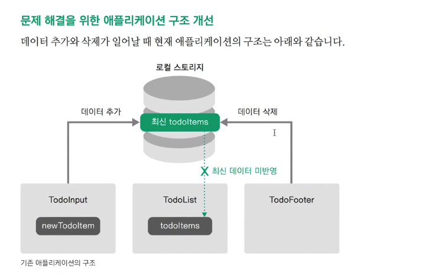
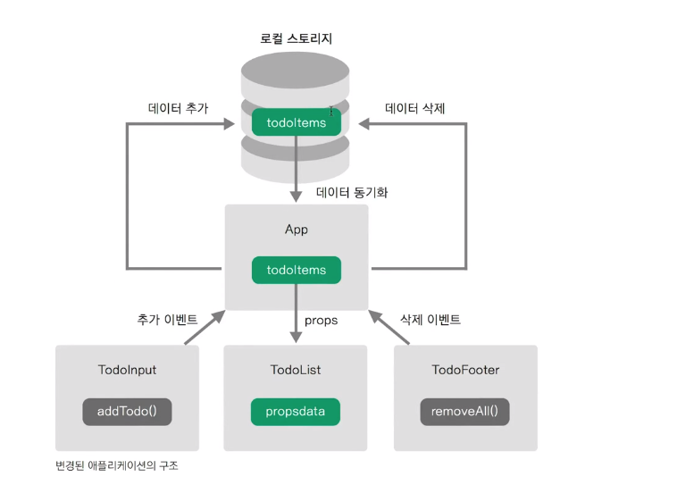
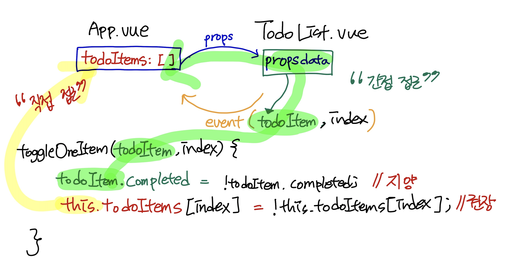

# 현재 앱 구조의 문제점 진단 및 개선된 앱 구조 소개

## 현재 앱 구조의 문제점

1. localStorage가 비워져도, 화면에서 뿌려주는 목록에 변화가 없다. (새로고침해야 반영이 된다.)

2. 화면에서 `Clear ALL` 을 하면 localStorage가 비워지지만 화면에 변화가 없다.

   Clear ALL은 FooterComponent인데 목록을 뿌려주는 ListComponent에게 해당 사실을 알리지 않았기 때문이다.

컴포넌트가 분리되면서 각각의 컴포넌트 간에 데이터 전달이 안되고 전송이 안돼서 생기는 문제이다.


## 개선된 앱 구조

### AS-IS




### TO-BE




전체 컴포넌트가 하나의 데이터만 바라보는 구조이다.

전체적인 컴포넌트에서 사용할 데이터를 한 곳으로 모으고, 한 곳에서만 데이터 조작이 일어난다.

TodoInput, TodoList, TodoFooter 등의 하위 컴포넌트들은 표현만 한다.

실질적인 데이터 조작은 공통적으로 가지고 있는 상위 컴포넌트인 `App`을 만들어서 여기에서 진행한다.

App에서는 `todoItems` 속성으로 하위 컴포넌트에게 `props`로 전달하고, TodoInput과 TodoFooter에서 각각 이벤트가 발생하면 App의 `todoItems` 데이터가 변경된다.

* App은 **컨테이너** 개념으로 보면 된다.
* 컴포넌트 설계 관점
  * 프레젠터 : 단순히 화면을 표현하는 컴포넌트
    * TodoInput, TodoList, TodoFooter
  * 컨테이너 : 앱의 동작, 데이터 조작 등 비지니스 로직이 들어간 컴포넌트
    * App


---

# 할 일 목록 표시 기능

**App.vue**

* App에서 todoItems 데이터를 가지고 있도록 data에 선언한다.
* localStorage에 저장된 값을 todoItems에 넣어주던 `created` 뷰 라이프 사이클 로직을 (as-is: TodoList → ) 여기서 수행하도록 한다.
*  `v-bind`를 이용해 하위 컴포넌트에게 `propsdata`라는 이름으로 데이터를 전달

```html
<TodoList v-bind:내려보낼 프롭스 속성 이름="현재 위치의 컴포넌트 데이터 속성"></TodoList>
<TodoList v-bind:propsdata="todoItems"></TodoList>
```


**TodoList.vue**

* 하위 컴포넌트에서 전달 받을 데이터 변수를 선언하면 된다.

```vue
<script>
export default {
    props: ['propsdata'],
  
}
</script>
```


> [깃헙 소스코드 참고](https://github.com/blossun/study-vue/commit/a2cd7985151c0fac6160e1f7ed917e23d815b2f3)


# 할 일 추가 기능

**App.vue**

* 하위 컴포넌트에서 발생시킨 이벤트를 받아서 실행할 메서드를 매핑

```html
<TodoInput v-on:하위 컴포넌트에서 발생시킨 이벤트 이름="실행할 현재 컴포넌트의 메서드명"></TodoInput>
<TodoInput v-on:addTodoItem="addOneItem"></TodoInput>
```

* `addOneItem()` 메서드 정의

```vue
<script>
export default {
    methods: {
    addOneItem: function(todoItem) {
      var obj = {completed: false, item: todoItem};
      localStorage.setItem(todoItem, JSON.stringify(obj)); //로컬스토리지에 저장 obj -> String
      this.todoItems.push(obj); //로컬스토리지 목록과 할일 목록 동기화
    }
  }
}
</script>
```


**TodoInput.vue**

* 이벤트를 발생시키고, 필요한 데이터를 파라미터로 넣어준다.
* 특정 버튼을 click하면 `addTodo()` 메서드가 실행되고, 여기에서 이벤트를 발생시켜서 상위 컴포넌트에서 받을 수 있도록 해야한다. 필요한 데이터는 인자로 넘겨준다.

```vue
<script>
export default {
    methods: {
        addTodo: function() {
            if (this.newTodoItem !== '') {
                // this.$emit('이벤트 이름', 인자1, 인자2, ...);
                this.$emit('addTodoItem',this.newTodoItem); //이벤트 발행
                this.clearInput();
            }
        },
        clearInput: function() {}
    }
}
</script>
```


> [깃헙 소스코드 참고](https://github.com/blossun/study-vue/commit/1da23b7d942501d610978a4b5860114ac4d1fec9)


# 할 일 삭제 기능

**App.vue**

* 주의) localStorage에서 removeItem()으로 데이터를 삭제할 때, 객체인 `todoItem`을 지정하는 것이 아니라 삭제할 `key`값을 지정해줘야 한다.

```script
localStorage.removeItem(todoItem.item); //로컬스토리지에서 삭제
```


```vue
<template>
  <div id="app">
    <TodoList v-bind:propsdata="todoItems" v-on:removeItem="removeOneItem"></TodoList>
  </div>
</template>

<script>
export default {
  methods: {
    removeOneItem: function(todoItem, index) {
      localStorage.removeItem(todoItem.item); //로컬스토리지에서 삭제
      this.todoItems.splice(index, 1); //화면에서 삭제. 해당 index에서부터 1개 item 삭제
    }
  }
}
</script>
```


**TodoList.vue**

* 이벤트 발행

```vue
<script>
export default {
    methods: {
        removeTodo: function(todoItem, index) {
            this.$emit('removeItem', todoItem, index) //이벤트 발행
        }
    }
}
</script>
```


> [깃헙 소스코드 참고](https://github.com/blossun/study-vue/commit/6c75ae03910a11d79aed4e9cdaf9600e1cbd0800)


# 할 일 완료 기능

**App.vue**

* `toggleItem` 이벤트가 발생하면, `toggleOneItem()` 메서드 실행

* 주의 ) `toggleOneItem()`에서 `todoItem` 데이터를 변경할 때, 하위컴포넌트로 부터 넘겨받은 `todoItem` 에 접근해서 변경하는 것은 안티패턴이다.

  이 `todoItem`은 결국 현재  `App` 컴포넌트에서 넘겨준 `todoItems`이기 때문에 `this`로 자신의 data를 변경하는 것이 좋은 프랙티스이다.

* **"특정 컴포넌트의 데이터는 해당 컴포넌트에서만 변경한다는 규칙"**을 지키자. (그냥 사용하는 것은 괜찮다.)

```vue
<template>
  <div id="app">
    <TodoList v-bind:propsdata="todoItems" 
              v-on:removeItem="removeOneItem"
              v-on:toggleItem="toggleOneItem"></TodoList>
  </div>
</template>

<script>
export default {
  methods: {
    toggleOneItem: function(todoItem, index) {
      // todoItem.completed = !todoItem.completed; //안티 패턴
      this.todoItems[index].completed = !this.todoItems[index].completed; //권장

      //로컬스토리지의 데이터를 갱신
      localStorage.setItem(todoItem.item, JSON.stringify(todoItem));
    }
  }
}
</script>
```




**TodoList.vue**

* 이벤트 발행

```vue
<script>
export default {
    methods: {
        toggleComplete: function(todoItem, index) {
            this.$emit('toggleItem', todoItem, index)
        }
    }
}
```


> [깃헙 소스코드 참고](https://github.com/blossun/study-vue/commit/c1cb08d3e1cc89f3a586415f0a62705d32650fcc)


# 할 일 모두 삭제 기능

**App.vue**

* localStorage도 비워주고, todoItems 배열도 초기화한다.

```vue
<template>
  <div id="app">
    <TodoFooter v-on:clearAll="clearAllItems"></TodoFooter>
  </div>
</template>

<script>
import TodoHeader from './components/TodoHeader.vue'
import TodoInput from './components/TodoInput.vue'
import TodoList from './components/TodoList.vue'
import TodoFooter from './components/TodoFooter.vue'

export default {
  methods: {
    clearAllItems: function() {
      localStorage.clear();
      this.todoItems = []; //비워줘야함
    }
  }
}
</script>
```


**TodoFooter.vue**

* 이벤트 발행

```vue
<script>
export default {
    methods: {
        clearTodo: function() {
            this.$emit('clearAll');
        }
    }
}
</script>
```


