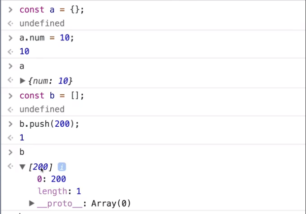

# ES6 배경과 Babel 소개

**개요**

* ES6의 여러가지 문법 중 Vue.js 코딩을 간편하게 해주는 문법 학습
* const & let, Arrow Function, Enhanced Object Literals, Modules 학습

> [Babel Docs](https://babeljs.io/docs/en/)

## ES6 란?

* ECMAScript(이크마스크립트) 2015와 동일한 용어
* 2015년은 ES5(2009년)이래로 진행한 첫 메이저 업데이트가 승인된 해
* 최신 Front-End Framework인 React, Angular, Vue에서 권고하는 언어 형식
* ES5에 비해 문법이 간결해져서 익숙해지면 코딩을 훨씬 편하게 할 수 있음

## Babel

* 구 버전 브라우저 중에서는 ES6의 기능을 지원하지 않는 브라우저가 있으므로 transpiling이 필요
* **ES6의 문법을 각 브라우저의 호환 가능한 ES5로 변환(transpiling)**하는 컴파일러

* 아래 코드는 webpack에 있는 Babel Loader를 사용한 것이다.

  최신 `vue-cli`를 이용해서 프로젝트를 구성했기 때문에 webpack을 더이상 신경쓰지 않아도 돼서 따로 설정할 것이 없다. (하지만 알고있어야 하는 내용이다.)

사이트에서 ES6 문법을 치면 바로 ES5 변환된 문법을 확인할 수 있다.

## ES5 특징 - 변수의 Scope

## ES5 특징 - Hoisting

* Hoisting : 끌어올리기

※ **함수 표현식**은 해당되지 않는다.

**※ 함수 선언문 vs 함수 표현식**

---

# const & let

---

# 화살표 함수

> [Babel 온라인 에디터](https://babeljs.io/repl/) 에서 실습해볼 수 있다.
> (왼)ES6 문법 → (오)ES5 문법으로 transpiling 해주는 데모 환경

